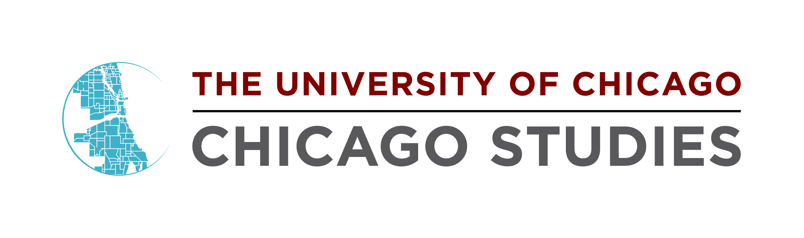
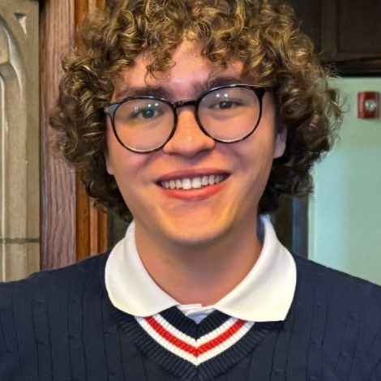
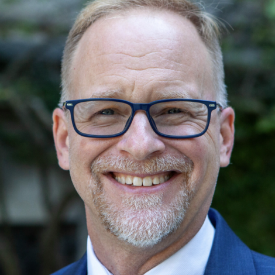

<!-- Main -->

<!-- One -->
<section id="one">
	

		<header class="major">
			<h1>About Us</h1>
		</header>

<!-- Content -->

<h2 id="content">Chicago Studies</h2>

Chicago Studies makes it easier for the University of Chicago College to forge genuine bonds with our amazing city. They offer O-Week and Welcome Week programming, sponsor classes and city-based research initiatives, and share resources to help you be more than a visitor while you're here, so you can better understand (and have a positive impact on) your new home.

	

		
		<h3>Parker Otto</h3>
		
Parker Otto was the inaugural Herbert Zarr Post-Baccalaureate Fellow in GIS with the University of Chicago Library's Center for Digital Scholarship.  He currently serves as the Graduate Research Coordinator for the Chicago Studies Program and is working on his masters in city and regional planning at the University of Pennsylvania.  The underlying code and computational workflow that makes the Chicago Urban Heritage Project possible was developed by him in May of 2024 as part of the GIScience Practicum course at the University of Chicago.

	

	

		
		<h3>Chris Skrable</h3>
		
Chris Skrable is the inaugural Executive Director of Chicago Studies and Experiential Learning and Assistant Dean of the College.  In that capacity, he works to co-create respectful academic projects and partnerships that help the College learn from and with the communities of the city in which it makes its home.

	

<h2 id="content">Student Workers</h2>

The Chicago Urban Heritage Project would not be possible without the fantastic work of its student research assistants.
 <h4>Active Cohort (Winter 2026)</h4>
<b>Student Supervisors:</b> Griggs Fuller, Sophia Liu
 <b>Student Researchers:</b> Yixin Chen, Ana Estupinan, Alex Arnell, Sergio Marquez, Nick Emerton, Sebastian Altomare
  <h4>Partners</h4>
Dr. Emily Talen's Urbanism Lab
 Dr. Emily Talen's Historical Preservation Class
 Summer Institute in Social Research Methods (SISRM)
  <h4>Alumni</h4>
Hannah Chen (Spring '25)
 Nathalie Lam (Summer '25)
 Ella Montgomery (Summer '25)
 Elena Osse (Summer '25 - Fall '25)
 Dave Rotblatt (Spring '25 - Summer '25)
 Shiv Shamdasani (Summer '25)
 Micah Sheinberg (Summer '25)
  <h4>Inaugural Cohort (Spring 2025):</h4>
Dave Rotblatt, Griggs Fuller, Hannah Chen, Sophia Liu, Yixin Chen, Ana Estupinan.

<h2 id="content">UChicago Library Center for Digital Scholarship</h2>

This website was designed with help from the Center for Digital Scholarship with special thanks to Digital Scholarship Librarian, Taylor Faires. The Center for Digital Scholarship is a resource hub for digital methods in research and learning. They provide consultations and services on digital projects, data, and research dissemination.

</section>

